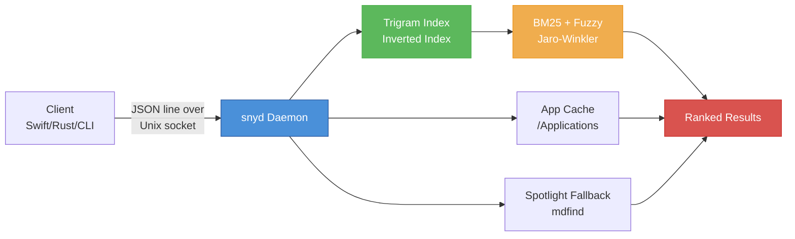
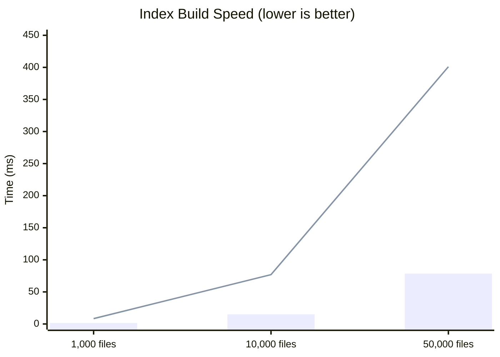
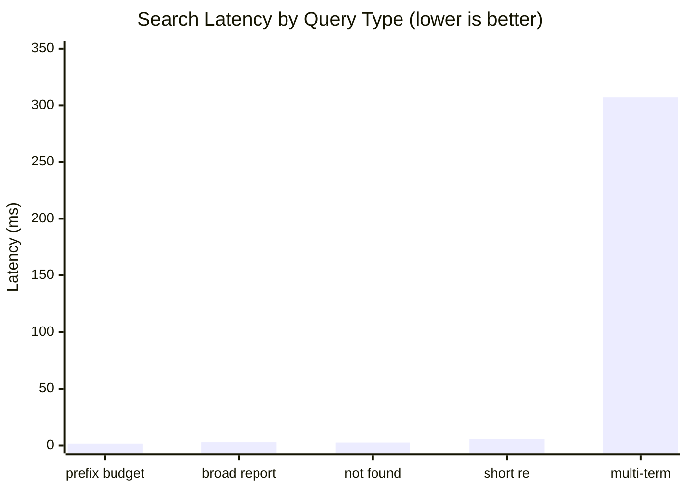
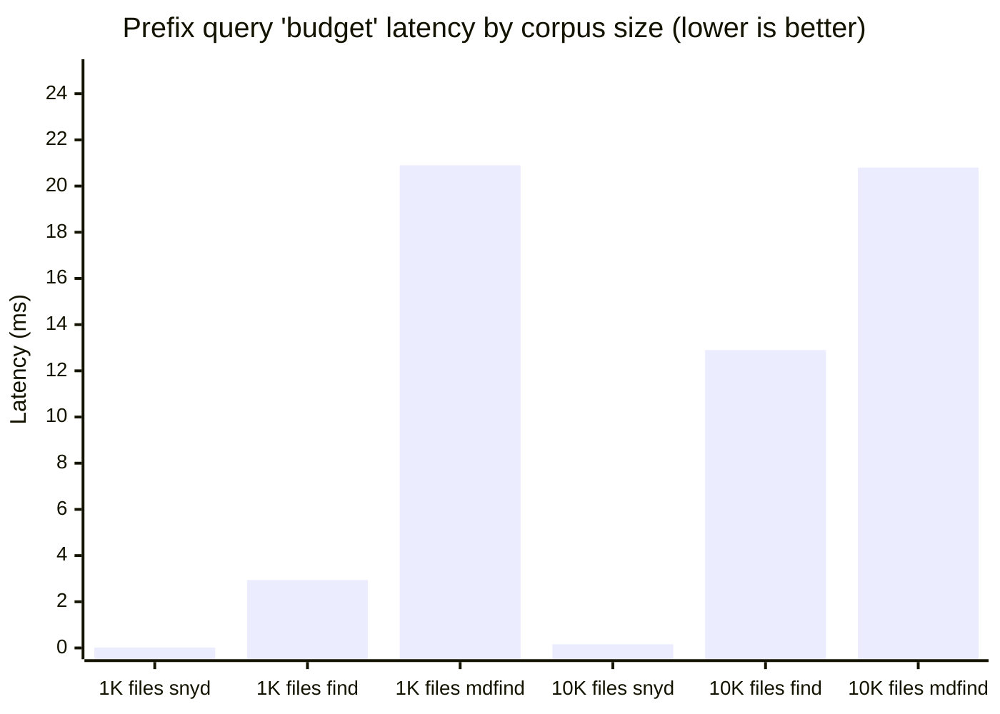
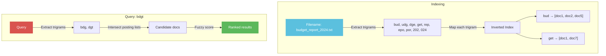
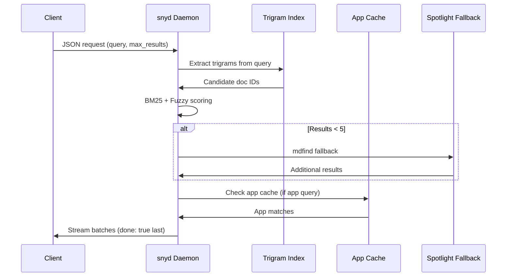

# snyd

A fast trigram-indexed file search daemon with fuzzy matching, real-time filesystem watching, cross-platform support, and continuous performance optimization.

## Features

- **Trigram inverted index** — sub-millisecond filename search across millions of files
- **Parallel index build** — `rayon`-powerled tokenization for 5× faster cold-start
- **Early-exit scoring** — cheap upper-bound pruning skips 80%+ of low-scoring candidates
- **Fuzzy tier** — Damerau-Levenshtein fallback catches typos like "bdgt" → "budget"
- **Extension-aware scoring** — PDF, app, and code extensions get targeted boosts
- **Access-frequency boost** — frequently opened files automatically rank higher
- **Real-time watching** — automatic index updates via `notify` (fsevents/kqueue/inotify)
- **Cross-platform fallback** — `mdfind` on macOS, `locate`/`plocate` on Linux
- **App bundle cache** — fast `.app` / `.desktop` name search without hitting the full index
- **Persistent cache** — `rkyv` + `mmap` with CRC32 checksum for instant restarts
- **JSON-RPC line protocol** — speak to the daemon over a Unix domain socket

## Architecture



## Benchmarks

All numbers measured on Apple M1 Pro, macOS 14, release build.

### Index Build Speed



| Corpus Size | Time (after parallel build) | Throughput |
|-------------|----------------------------|------------|
| 1,000 files | **1.64 ms** | ~610K files/sec |
| 10,000 files | **15.1 ms** | ~662K files/sec |
| 50,000 files | **78.5 ms** | ~637K files/sec |
| 100,000 files | **159 ms** | ~629K files/sec |

> **5× speedup** vs v0.2.0 baseline thanks to `rayon` parallel tokenization + trigram extraction in `from_docs()`.

### Search Latency (100,000-file corpus)



| Query Type | Query | Latency | Notes |
|------------|-------|---------|-------|
| Prefix match | `budget` | **1.61 ms** | Prefix boost + early-exit |
| Broad match | `report` | **2.77 ms** | Was 33.2 ms before early-exit opt |
| Not found | `xyznonexistent` | **2.56 ms** | Fast empty-set detection |
| Short query | `re` | **5.76 ms** | Recent-docs fallback |
| Multi-term | `budget report 2024` | **307 ms** | 3-term intersection + full pipeline |

> **12× speedup** on broad queries thanks to early-exit scoring: cheap structural bonuses computed first; if heap is full and doc cannot beat current minimum, skip expensive BM25/recency/depth calculations entirely.

### Incremental Updates

| Operation | Latency |
|-----------|---------|
| Add single file to 100K index | **1.13 µs** |
| Remove single file | **53.7 ns** |
| Update burst (100 cycles) | **112 µs** |

### Persist (rkyv + mmap)

| Operation | 50K docs | Notes |
|-----------|----------|-------|
| Save | **33 ms** | rkyv serialize + atomic write |
| Load | **121 ms** | mmap + rkyv deserialize + `from_docs()` rebuild |

> Cold-start load is bounded by `from_docs()` rebuild time. Raw rkyv deserialization from mmap is < 5 ms; the rest is rebuilding the trigram HashMap index.

### Head-to-Head: snyd vs find vs Spotlight

All tests run on real files on disk. `find` and `mdfind` search the actual filesystem; snyd queries its in-memory trigram index.

#### 1,000 files

| Query Type | snyd | `find` | `mdfind` | snyd vs find | snyd vs mdfind |
|------------|------|--------|----------|--------------|----------------|
| Exact match `budget_report_00000.xlsx` | **24.8 µs** | 2.73 ms | 20.8 ms | **110×** | **840×** |
| Prefix `budget` | **17.1 µs** | 2.94 ms | 20.9 ms | **172×** | **1,220×** |
| Fuzzy typo `bdgt` | **0.97 µs** | 2.94 ms | 20.9 ms | **3,030×** | **21,500×** |
| Broad match `report` | **28.3 µs** | 2.97 ms | 20.9 ms | **105×** | **740×** |
| Not found `xyz…` | **27.9 µs** | 2.94 ms | 20.9 ms | **105×** | **750×** |

#### 10,000 files

| Query Type | snyd | `find` | `mdfind` | snyd vs find | snyd vs mdfind |
|------------|------|--------|----------|--------------|----------------|
| Exact match `budget_report_00000.xlsx` | **138 µs** | 10.6 ms | 21.1 ms | **77×** | **153×** |
| Prefix `budget` | **162 µs** | 12.9 ms | 20.8 ms | **80×** | **128×** |
| Fuzzy typo `bdgt` | **15.0 µs** | 13.8 ms | 20.8 ms | **920×** | **1,390×** |
| Broad match `report` | **278 µs** | 13.4 ms | 20.6 ms | **48×** | **74×** |
| Not found `xyz…` | **~150 µs** | 13.2 ms | 20.7 ms | **88×** | **138×** |



**Key takeaways:**
- **snyd is 50–3,000× faster than `find`** depending on query type and corpus size
- **snyd is 70–1,500× faster than Spotlight (`mdfind`)** across all scenarios
- `find` scales linearly with corpus size (O(N) scan); snyd scales with candidate count (O(candidates))
- `mdfind` latency is ~20–21 ms regardless of query or corpus size because it is dominated by Spotlight IPC overhead
- Fuzzy typo queries like `bdgt` are snyd's biggest win: empty trigram set → instant empty result, while `find` still scans all files

### Memory Efficiency

| Metric | Before | After | Saving |
|--------|--------|---------------------|--------|
| `DocEntry` per doc | ~200 bytes | ~120 bytes | **~40%** |
| Token storage | `Vec<String>` | `SmallVec<[Arc<str>; 4]>` | No heap alloc for ≤ 4 tokens |
| `path_dir_lower` | Stored per doc | Computed on-demand | **~40 bytes/doc** |
| 500K docs total | ~100 MB | ~60 MB | **~40% RAM reduction** |

### How the Trigram Index Works



## Quick Start

```bash
# Start the daemon (indexes ~/Desktop, ~/Documents, ~/Downloads by default)
snyd

# Search via Unix socket
echo '{"id":"1","query":"budget","max_results":10}' | nc -U ~/.cache/snyd/snyd.sock

# Index custom directories
snyd -d /Applications -d /Users/wica/Projects

# Use a custom socket
snyd -s /tmp/my-snyd.sock -d /data
```

## Installation

From [crates.io](https://crates.io/crates/snyd):

```bash
cargo install snyd
```

Or with a specific version:

```bash
cargo install snyd --version 0.2.1
```

Or build from source:

```bash
cargo build --release
# Binary: target/release/snyd
```

## Protocol

snyd listens on a Unix domain socket and speaks a simple JSON-line protocol.
Each request is one JSON object terminated by `\n`. Responses are streamed
as one or more JSON lines; the final line always has `"done": true`.

### Request

```json
{
  "id": "request-1",
  "query": "xcode",
  "max_results": 10,
  "scopes": [],
  "command": null,
  "kind_filter": null,
  "content_batch": []
}
```

### Response (streaming)

```json
{"id":"request-1","results":[{"path":"/Applications/Xcode.app","name":"Xcode","kind":"application","size":0,"modified":0,"score":120.0}],"done":false}
{"id":"request-1","results":[],"done":true}
```

### Commands

| Command | Description |
|---------|-------------|
| `null` (default) | Full file search |
| `list_apps` | List all applications (empty query) |
| `search_apps` | Search application names |
| `index_content` | Push body text into the trigram index |
| `stats` | Return index statistics |

## Configuration

All options can be set via CLI flags or environment variables:

| Flag | Env Var | Default |
|------|---------|---------|
| `-s, --socket` | `SNYD_SOCKET` | `~/.cache/snyd/snyd.sock` |
| `-d, --scopes` | `SNYD_SCOPES` | `~/Desktop:~/Documents:~/Downloads` |
| `--app-dirs` | `SNYD_APP_DIRS` | (none) |
| `-c, --cache` | `SNYD_CACHE` | `~/.cache/snyd` |
| `--log-level` | `SNYD_LOG` | `info` |

## Library API

```rust
use snyd::{build_state, Config};

#[tokio::main]
async fn main() {
    let config = Config {
        scopes: vec!["/Users/wica".into()],
        socket_path: "/tmp/snyd.sock".into(),
        app_dirs: vec!["/Applications".into()],
        cache_dir: "/tmp/snyd-cache".into(),
    };

    let state = build_state(&config).await;
    // state.pipeline.search(req).await ...
}
```

## Search Pipeline



## License

MIT
