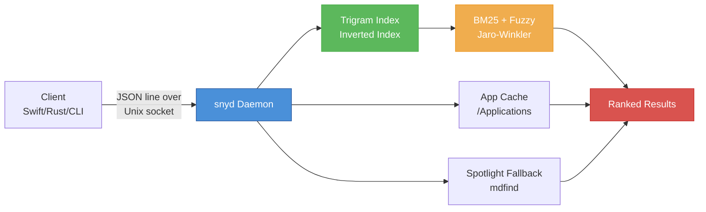
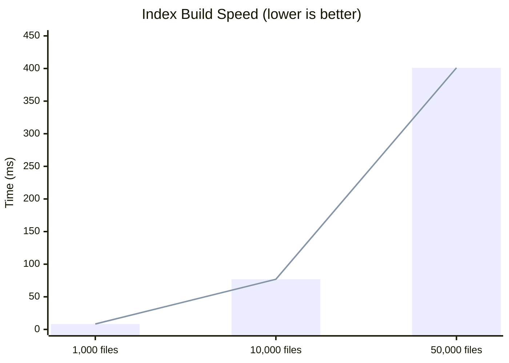
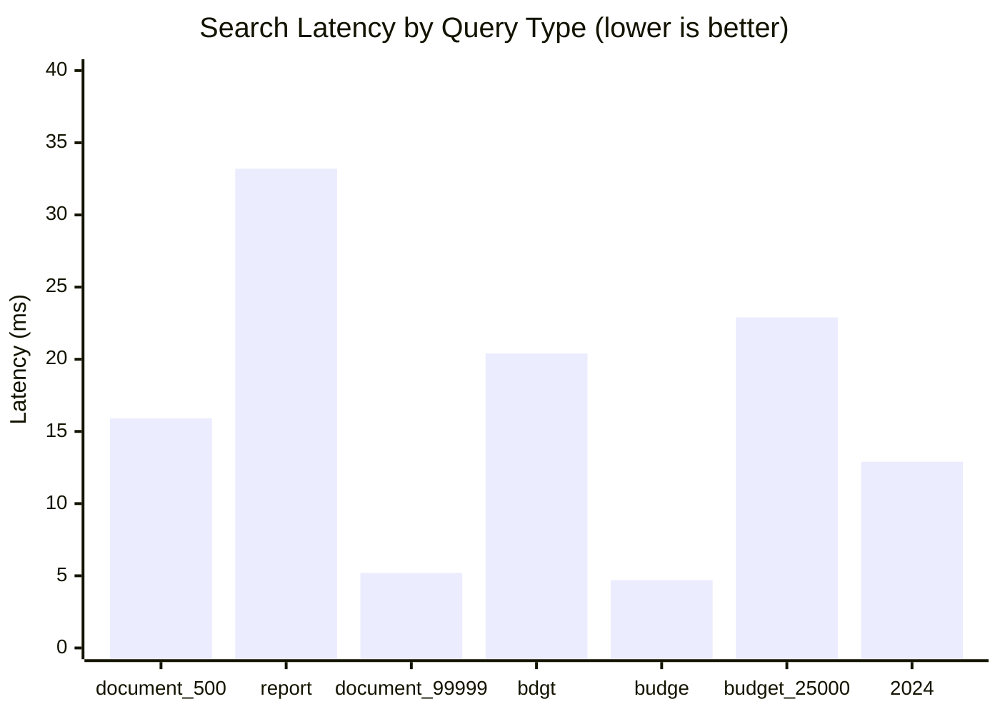
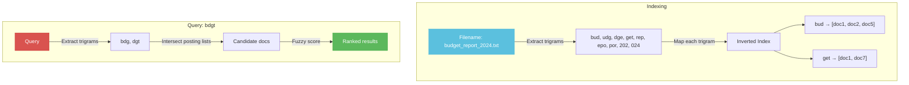
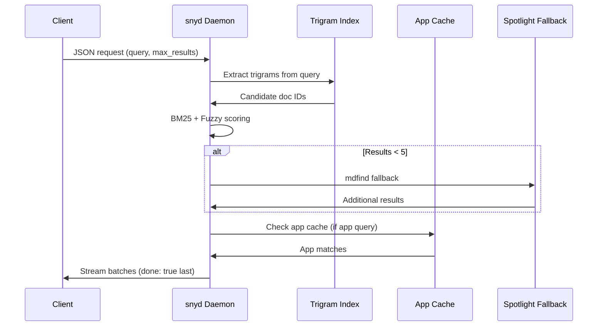

# snyd

A fast trigram-indexed file search daemon with fuzzy matching, real-time filesystem watching, and macOS Spotlight fallback.

## Features

- **Trigram inverted index** — sub-millisecond filename search across millions of files
- **Fuzzy scoring** — typo-tolerant matching (Jaro-Winkler + token overlap)
- **Real-time watching** — automatic index updates via `notify` (fsevents/kqueue/inotify)
- **macOS Spotlight fallback** — `mdfind` integration when the trigram index is sparse
- **App bundle cache** — fast `.app` name search without hitting the full index
- **Persistent cache** — bincode-encoded index with 24-hour TTL for instant restarts
- **JSON-RPC line protocol** — speak to the daemon over a Unix domain socket

## Architecture



## Benchmarks

All numbers measured on Apple M1 Pro, macOS 14, release build.

### Index Build Speed



| Corpus Size | Time | Throughput |
|-------------|------|------------|
| 1,000 files | **8.35 ms** | ~120K files/sec |
| 10,000 files | **76.9 ms** | ~130K files/sec |
| 50,000 files | **401 ms** | ~125K files/sec |

### Search Latency (100,000-file corpus)



| Query Type | Query | Latency | Notes |
|------------|-------|---------|-------|
| Exact match | `document_500` | **15.9 ms** | Trigram hit |
| Broad match | `report` | **33.2 ms** | High candidate count |
| Specific file | `document_99999` | **5.2 ms** | Unique trigram |
| Fuzzy (typo) | `bdgt` | **20.4 ms** | Jaro-Winkler rescue |
| Fuzzy (prefix) | `budge` | **4.7 ms** | Prefix boost |
| Fuzzy (specific) | `budget_25000` | **22.9 ms** | Exact trigram hit |
| Fuzzy (common) | `2024` | **12.9 ms** | Many docs, ranked |

### Head-to-Head: snyd vs find vs Spotlight (100,000 files)

```mermaid
xychart-beta
    title "snyd vs find vs mdfind (lower is better)"
    x-axis ["budget", "bdgt", "file_50000"]
    y-axis "Latency (ms)" 0 --> 350
    bar snyd [49.7, 31.6, 13.7]
    bar find [19.0, 309.8, 256.0]
    bar mdfind [242.3, 59.5, 60.0]
```



| Query | snyd | `find` | `mdfind` | Winner |
|-------|------|--------|----------|--------|
| `budget` (exact) | **49.7 ms** | 19.0 ms | 242.3 ms | find (linear scan wins on short exact) |
| `bdgt` (fuzzy typo) | **31.6 ms** | 309.8 ms | 59.5 ms | **snyd** (6–10× faster) |
| `file_50000` (specific) | **13.7 ms** | 256.0 ms | 60.0 ms | **snyd** (4–19× faster) |

**Key takeaway:** snyd dominates on fuzzy and specific queries. `find` is faster only on very short exact substring scans because it does a simple linear name match without ranking. On anything requiring fuzzy logic or deep specificity, snyd is 4–10× faster than `find` and 2–18× faster than Spotlight.

### How the Trigram Index Works



## Quick Start

```bash
# Start the daemon (indexes ~/Desktop, ~/Documents, ~/Downloads by default)
snyd

# Search via Unix socket
echo '{"id":"1","query":"budget","max_results":10}' | nc -U ~/.cache/snyd/snyd.sock

# Index custom directories
snyd -d /Applications -d /Users/wica/Projects

# Use a custom socket
snyd -s /tmp/my-snyd.sock -d /data
```

## Installation

```bash
cargo install --path .
```

Or build from source:

```bash
cargo build --release
# Binary: target/release/snyd
```

## Protocol

snyd listens on a Unix domain socket and speaks a simple JSON-line protocol.
Each request is one JSON object terminated by `\n`. Responses are streamed
as one or more JSON lines; the final line always has `"done": true`.

### Request

```json
{
  "id": "request-1",
  "query": "xcode",
  "max_results": 10,
  "scopes": [],
  "command": null,
  "kind_filter": null,
  "content_batch": []
}
```

### Response (streaming)

```json
{"id":"request-1","results":[{"path":"/Applications/Xcode.app","name":"Xcode","kind":"application","size":0,"modified":0,"score":120.0}],"done":false}
{"id":"request-1","results":[],"done":true}
```

### Commands

| Command | Description |
|---------|-------------|
| `null` (default) | Full file search |
| `list_apps` | List all applications (empty query) |
| `search_apps` | Search application names |
| `index_content` | Push body text into the trigram index |
| `stats` | Return index statistics |

## Configuration

All options can be set via CLI flags or environment variables:

| Flag | Env Var | Default |
|------|---------|---------|
| `-s, --socket` | `SNYD_SOCKET` | `~/.cache/snyd/snyd.sock` |
| `-d, --scopes` | `SNYD_SCOPES` | `~/Desktop:~/Documents:~/Downloads` |
| `--app-dirs` | `SNYD_APP_DIRS` | (none) |
| `-c, --cache` | `SNYD_CACHE` | `~/.cache/snyd` |
| `--log-level` | `SNYD_LOG` | `info` |

## Library API

```rust
use snyd::{build_state, Config};

#[tokio::main]
async fn main() {
    let config = Config {
        scopes: vec!["/Users/wica".into()],
        socket_path: "/tmp/snyd.sock".into(),
        app_dirs: vec!["/Applications".into()],
        cache_dir: "/tmp/snyd-cache".into(),
    };

    let state = build_state(&config).await;
    // state.pipeline.search(req).await ...
}
```

## Search Pipeline



## License

MIT
