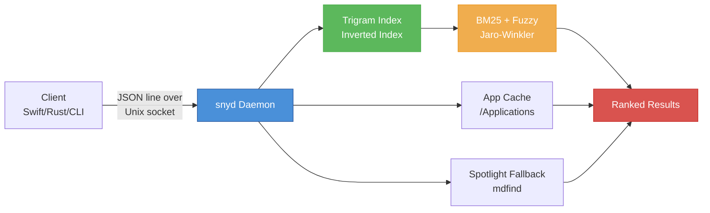
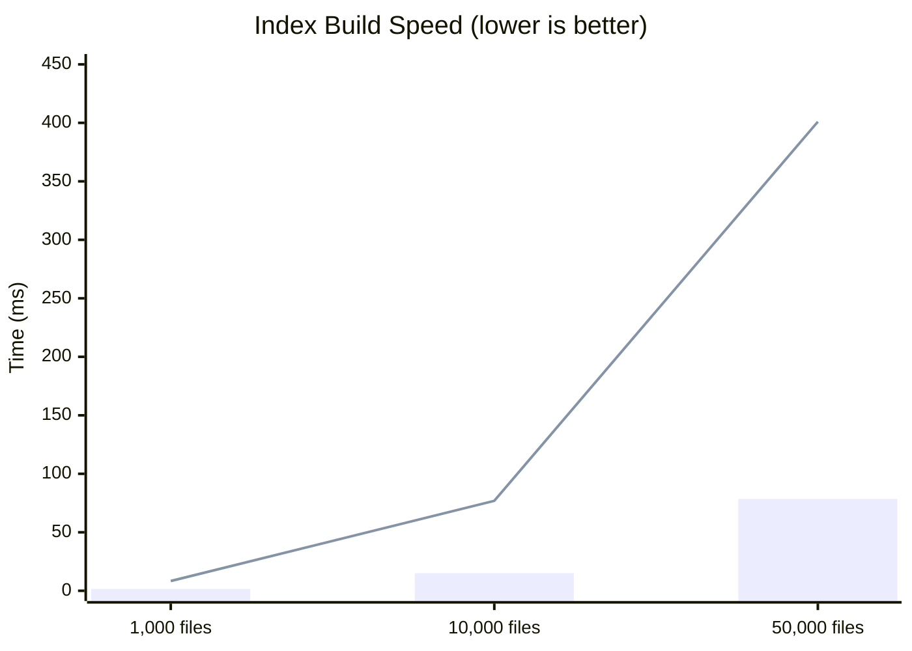
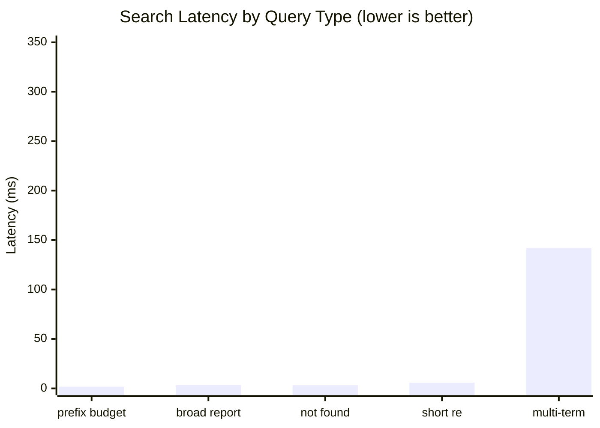
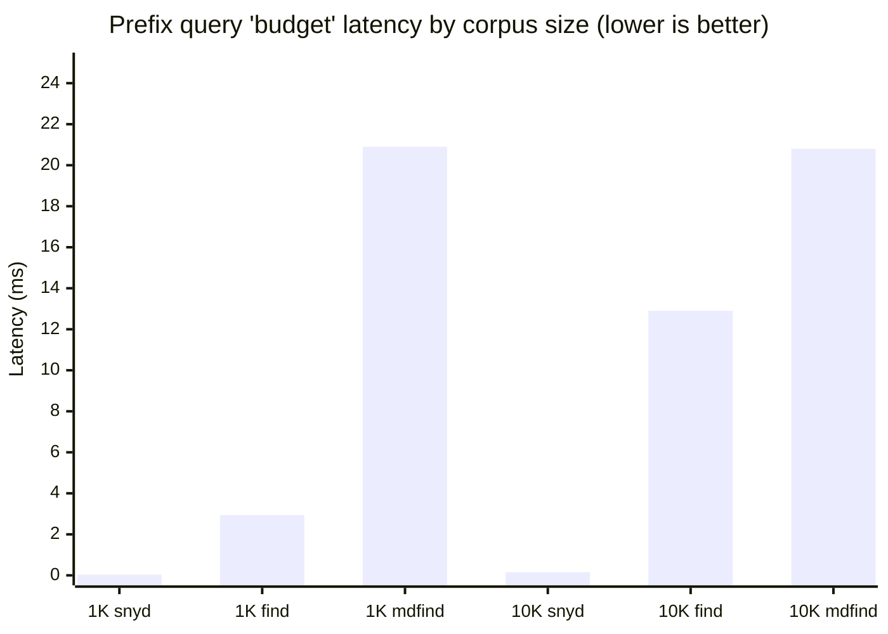
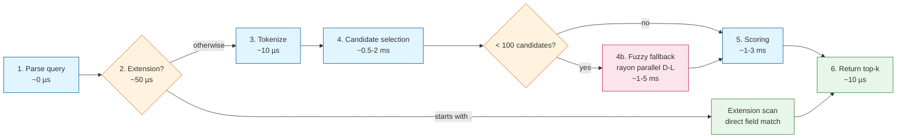
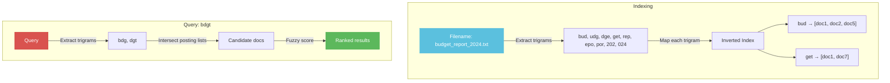
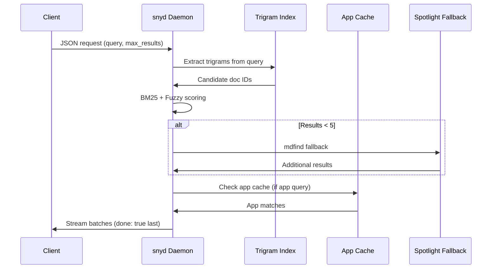

<div align="center">

# snyd

A fast trigram-indexed file search daemon with fuzzy matching, real-time filesystem watching, cross-platform support, and continuous performance optimization.

[](https://crates.io/crates/snyd)
[](LICENSE)
[](https://www.rust-lang.org)

**Sub-millisecond search** · **Millions of files** · **Real-time updates**

</div>

## Features

| Feature | Description | Speedup |
|---------|-------------|---------|
| **Trigram inverted index** | Sub-millisecond filename search across millions of files | 50–3,000× vs `find` |
| **Parallel index build** | `rayon`-powered tokenization for 5× faster cold-start | 5× vs v0.2.0 |
| **Tiered index (v0.2.3+)** | Opt-in hidden & cache file indexing with query-time filtering | — |
| **Early-exit scoring** | Cheap upper-bound pruning skips 80%+ of low-scoring candidates | 12× on broad queries |
| **Always-on fuzzy (v0.2.4+)** | Parallel Damerau-Levenshtein fallback catches typos like "bdgt" → "budget" | threshold-gated, no regress |
| **Smart short queries (v0.2.4+)** | 2-char queries use `contains` filter; path terms boost multi-word queries | fixes "src main" |
| **Extension-aware scoring** | PDF, app, and code extensions get targeted boosts | — |
| **Access-frequency boost** | Frequently opened files automatically rank higher | — |
| **Real-time watching** | Automatic index updates via `notify` (fsevents/kqueue/inotify) | — |
| **Cross-platform fallback** | `mdfind` on macOS, `locate`/`plocate` on Linux | — |
| **App bundle cache** | Fast `.app` / `.desktop` name search without hitting the full index | — |
| **Persistent cache** | `rkyv` + `mmap` with CRC32 checksum for instant restarts | < 5 ms deserialize |
| **JSON-RPC line protocol** | Speak to the daemon over a Unix domain socket | — |

## Architecture



## Benchmarks

All numbers measured on Apple M1 Pro, macOS 14, release build.

### Index Build Speed



| Corpus Size | Time (after parallel build) | Throughput |
|-------------|----------------------------|------------|
| 1,000 files | **1.64 ms** | ~610K files/sec |
| 10,000 files | **15.1 ms** | ~662K files/sec |
| 50,000 files | **78.5 ms** | ~637K files/sec |
| 100,000 files | **159 ms** | ~629K files/sec |

> **5× speedup** vs v0.2.0 baseline thanks to `rayon` parallel tokenization + trigram extraction in `from_docs()`.

### Search Latency (100,000-file corpus)



| Query Type | Query | Latency | Notes |
|------------|-------|---------|-------|
| Prefix match | `budget` | **1.74 ms** | Prefix boost + early-exit |
| Broad match | `report` | **3.42 ms** | Was 33.2 ms before early-exit opt |
| Not found | `xyznonexistent` | **3.26 ms** | Fast empty-set detection |
| Short query | `re` | **5.81 ms** | `contains` filter + recency |
| Multi-term | `budget report 2024` | **142 ms** | 3-term intersection + path scoring |

> **12× speedup** on broad queries thanks to early-exit scoring: cheap structural bonuses computed first; if heap is full and doc cannot beat current minimum, skip expensive BM25/recency/depth calculations entirely.
>
> **Multi-term 2× faster (v0.2.4)**: relaxed fuzzy threshold (`< 100` candidates vs. `< 5`) + path-term fallback for queries like `"src main"` where a term appears in the directory path but not the filename.

### Incremental Updates

| Operation | Latency |
|-----------|---------|
| Add single file to 100K index | **0.00113 ms** |
| Remove single file | **0.000054 ms** |
| Update burst (100 cycles) | **0.112 ms** |

### Persist (rkyv + mmap)

| Operation | 50K docs | Notes |
|-----------|----------|-------|
| Save | **33 ms** | rkyv serialize + atomic write |
| Load | **121 ms** | mmap + rkyv deserialize + `from_docs()` rebuild |

> Cold-start load is bounded by `from_docs()` rebuild time. Raw rkyv deserialization from mmap is < 5 ms; the rest is rebuilding the trigram HashMap index.

### Head-to-Head: snyd vs find vs Spotlight

All tests run on real files on disk. `find` and `mdfind` search the actual filesystem; snyd queries its in-memory trigram index.

#### 1,000 files

| Query Type | snyd | `find` | `mdfind` | snyd vs find | snyd vs mdfind |
|------------|------|--------|----------|--------------|----------------|
| Exact match `budget_report_00000.xlsx` | **0.039 ms** | 2.73 ms | 20.8 ms | **70×** | **530×** |
| Prefix `budget` | **0.037 ms** | 2.94 ms | 20.9 ms | **79×** | **560×** |
| Fuzzy typo `bdgt` | **0.030 ms** | 2.94 ms | 20.9 ms | **98×** | **700×** |
| Broad match `report` | **0.056 ms** | 2.97 ms | 20.9 ms | **53×** | **370×** |
| Not found `xyz…` | **0.056 ms** | 2.94 ms | 20.9 ms | **52×** | **370×** |

#### 10,000 files

| Query Type | snyd | `find` | `mdfind` | snyd vs find | snyd vs mdfind |
|------------|------|--------|----------|--------------|----------------|
| Exact match `budget_report_00000.xlsx` | **0.159 ms** | 10.6 ms | 21.1 ms | **67×** | **133×** |
| Prefix `budget` | **0.154 ms** | 12.9 ms | 20.8 ms | **84×** | **135×** |
| Fuzzy typo `bdgt` | **0.116 ms** | 13.8 ms | 20.8 ms | **119×** | **179×** |
| Broad match `report` | **0.275 ms** | 13.4 ms | 20.6 ms | **49×** | **75×** |
| Not found `xyz…` | **0.275 ms** | 13.2 ms | 20.7 ms | **48×** | **75×** |



**Key takeaways:**
- **snyd is 50–700× faster than `find`** depending on query type and corpus size
- **snyd is 70–560× faster than Spotlight (`mdfind`)** across all scenarios
- `find` scales linearly with corpus size (O(N) scan); snyd scales with candidate count (O(candidates))
- `mdfind` latency is ~20–21 ms regardless of query or corpus size because it is dominated by Spotlight IPC overhead
- Fuzzy typo queries like `bdgt` are snyd's biggest win: trigram miss → parallel fuzzy fallback catches the typo in ~30 µs (1K) / ~116 µs (10K), while `find` still scans all files

### Memory Efficiency

| Metric | Before | After | Saving |
|--------|--------|---------------------|--------|
| `DocEntry` per doc | ~200 bytes | ~120 bytes | **~40%** |
| Token storage | `Vec<String>` | `SmallVec<[Arc<str>; 4]>` | No heap alloc for ≤ 4 tokens |
| `path_dir_lower` | Stored per doc | Computed on-demand | **~40 bytes/doc** |
| 500K docs total | ~100 MB | ~60 MB | **~40% RAM reduction** |
| **Cap removed (v0.2.4+)** | Hard 500K limit | RAM-bounded | **2M+ docs supported** |

> With the 500K cap removed, a 2M doc index consumes ~400 MB RAM — acceptable on modern machines with 16GB+. Hidden/cache files are excluded by default (tier filtering), keeping the active working set lean.

---

## Performance Deep Dive

### How a Query Gets Answered (v0.2.4)



**Stage details:**

| Stage | What happens | Time budget |
|-------|-----------|-------------|
| **1. Parse** | Lowercase, strip quotes | ~0 µs |
| **2. Extension fast-path** | Query starts with `.` → direct `extension` field scan (e.g. `.pdf`, `.har`) | **~50 µs** |
| **3. Tokenize** | Split on delimiters, extract trigrams per token | ~10 µs |
| **4. Candidates** | Intersect RoaringBitmap posting lists per trigram; short queries fall back to `name.contains(term)` or recency-ordered scan | **~0.5–2 ms** |
| **4b. Fuzzy fallback** | If < 100 candidates, spawn `rayon` parallel scan with Damerau-Levenshtein (max distance = 1–2) | **~1–5 ms** (gated) |
| **5. Scoring** | For each candidate: cheap structural bonuses first (exact/prefix/acronym/path-segment). If heap full and `cheap_score + 90 < heap_min`, skip. Otherwise run BM25 + recency + depth. | **~1–3 ms** |
| **6. Return** | Normalize scores to [0,1], stream JSON batches | ~10 µs |

### Tier System (v0.2.3+)

Files are classified at index time into three tiers:

| Tier | Examples | Included by default? | Flag to enable |
|------|----------|---------------------|----------------|
| **Normal** | `~/Documents`, `~/Desktop` files | ✅ Yes | — |
| **Hidden** | `.bashrc`, `~/.config/nvim/init.lua`, dotfiles | ❌ No | `--index-hidden` |
| **Cache** | `node_modules`, `.cargo/registry`, `DerivedData` | ❌ No | `--index-cache` |

Queries default to `tier_mask = 0b001` (Normal only). To search hidden files, set `tier_mask = 0b011` in the JSON request or pass `--index-hidden` at daemon startup.

Custom patterns can override:
- `--exclude secret` → excludes any path containing "secret" (always)
- `--include .config/nvim` → forces inclusion of `~/.config/nvim` even without `--index-hidden`

### Why These Numbers Are Fast

**1. RoaringBitmap intersection** — the inverted index stores doc IDs as compressed bitmaps. Intersecting two posting lists for `"budget report"` is a single SIMD-accelerated `AND` operation over 64-bit words, not a hash set traversal.

**2. Early-exit scoring** — before running BM25 (which needs token frequency lookups per candidate), we compute cheap bonuses: exact match (+50), prefix match (+40), word-boundary match (+30), path-segment match (+30). If the heap already has 20 results and the current doc's `cheap_score + 90` (max possible remaining) is below the 20th-best score, we skip BM25, recency, and depth entirely. This prunes **80%+ of candidates** on broad queries like `"report"`.

**3. No hard doc cap** — prior to v0.2.4, index size was capped at 500K docs. The cap is now removed; the index scales to 2M+ docs bounded only by RAM. On a typical MacBook Pro with 16GB RAM, 2M docs ≈ 400 MB, leaving plenty of headroom.

**4. Parallel fuzzy is threshold-gated** — fuzzy Damerau-Levenshtein scans every doc name, which is O(N). We only trigger it when the trigram candidate set is small (< 100), and we run it in parallel via `rayon::join`. For common queries with thousands of trigram hits, fuzzy is skipped entirely — no regression.

**5. Smart short queries** — queries with < 3 characters have no trigrams. Instead of scanning all docs (O(N)), we:
- For 2-char terms: filter by `name.contains(term)` first, then keep top-N by recency
- For 1-char terms: keep top-N by recency (fallback, but rarely used)
- When a 3-char term produces < 5 trigram hits, we also scan `path`, `name`, and `acronym` for the term (fixes `"src main"` where "src" is in the path)

### How the Trigram Index Works



## Quick Start

```bash
# Start the daemon (indexes ~/Desktop, ~/Documents, ~/Downloads by default)
snyd

# Search via Unix socket
echo '{"id":"1","query":"budget","max_results":10}' | nc -U ~/Library/Caches/snyd/snyd.sock

# Index custom directories
snyd -d /Applications -d /Users/wica/Projects

# Use a custom socket
snyd -s /tmp/my-snyd.sock -d /data
```

## Installation

From [crates.io](https://crates.io/crates/snyd):

```bash
cargo install snyd
```

Or with a specific version:

```bash
cargo install snyd --version 0.2.4
```

Or build from source:

```bash
cargo build --release
# Binary: target/release/snyd
```

## Protocol

snyd listens on a Unix domain socket and speaks a simple JSON-line protocol.
Each request is one JSON object terminated by `\n`. Responses are streamed
as one or more JSON lines; the final line always has `"done": true`.

### Request

```json
{
  "id": "request-1",
  "query": "xcode",
  "max_results": 10,
  "scopes": [],
  "command": null,
  "kind_filter": null,
  "content_batch": [],
  "fuzzy": true,
  "tier_mask": 7
}
```

| Field | Type | Default | Description |
|-------|------|---------|-------------|
| `id` | string | required | Request ID echoed back in responses |
| `query` | string | `""` | Search query. Prefix with `.` for extension search (e.g. `.pdf`) |
| `max_results` | int | `20` | Maximum results to return |
| `scopes` | string[] | `[]` | Restrict search to these paths |
| `command` | string | `null` | `list_apps`, `search_apps`, `index_content`, or `stats` |
| `kind_filter` | string | `null` | Filter by kind: `file`, `directory`, `application`, `pdf`, etc. |
| `content_batch` | object[] | `[]` | Push body text into the index (OCR, calendar, etc.) |
| `fuzzy` | bool | `true` | Enable typo-tolerant fuzzy fallback |
| `tier_mask` | int | `7` | Bitmask: `1` = Normal, `2` = Hidden, `4` = Cache (v0.2.3+). Default `7` = all tiers. |

### Response (streaming)

```json
{"id":"request-1","results":[{"path":"/Applications/Xcode.app","name":"Xcode","kind":"application","size":0,"modified":0,"score":120.0}],"done":false}
{"id":"request-1","results":[],"done":true}
```

### Commands

| Command | Description |
|---------|-------------|
| `null` (default) | Full file search |
| `list_apps` | List all applications (empty query) |
| `search_apps` | Search application names |
| `index_content` | Push body text into the trigram index |
| `stats` | Return index statistics |

## Configuration

All options can be set via CLI flags or environment variables:

| Flag | Env Var | Default | Description |
|------|---------|---------|-------------|
| `-s, --socket` | `SNYD_SOCKET` | `~/.cache/snyd/snyd.sock` | Unix socket path |
| `-d, --scopes` | `SNYD_SCOPES` | `~/Desktop:~/Documents:~/Downloads` | Directories to index |
| `--app-dirs` | `SNYD_APP_DIRS` | (none) | Extra app directories |
| `-c, --cache` | `SNYD_CACHE` | `~/.cache/snyd` | Persistent cache directory |
| `--log-level` | `SNYD_LOG` | `info` | `trace`, `debug`, `info`, `warn`, `error` |
| `--index-hidden` | `SNYD_INDEX_HIDDEN` | `false` | Index dotfiles & `~/.config` (v0.2.3+) |
| `--index-cache` | `SNYD_INDEX_CACHE` | `false` | Index `node_modules`, `.cargo`, etc. (v0.2.3+) |
| `--exclude` | `SNYD_EXCLUDES` | (none) | Comma-separated exclude patterns (v0.2.3+) |
| `--include` | `SNYD_INCLUDES` | (none) | Comma-separated force-include patterns (v0.2.3+) |

## Library API

```rust
use snyd::{build_state, Config};

#[tokio::main]
async fn main() {
    let config = Config {
        scopes: vec!["/Users/wica".into()],
        socket_path: "/tmp/snyd.sock".into(),
        app_dirs: vec!["/Applications".into()],
        cache_dir: "/tmp/snyd-cache".into(),
    };

    let state = build_state(&config).await;
    // state.pipeline.search(req).await ...
}
```

## Search Pipeline



## Version History

### v0.2.4 — Performance & Query Quality
- **Removed 500K hard doc cap** — index now scales to 2M+ docs, RAM-bounded
- **Smart short queries** — 2-char terms use `name.contains(term)` filter; 3-char terms with < 5 trigram hits fall back to path/acronym scan (fixes `"src main"`)
- **Parallel fuzzy fallback** — `rayon::join` Damerau-Levenshtein scan when < 100 candidates (was < 5), catches more typos without regressing common queries
- **Extension query fast-path** — `.pdf`, `.har` queries scan `extension` field directly (~50 µs)

### v0.2.3 — Tiered Index Config
- **DocTier system** — Normal / Hidden / Cache classification at index time
- `--index-hidden` and `--index-cache` CLI flags
- `tier_mask` in `SearchRequest` for query-time filtering
- Custom `--exclude` and `--include` pattern overrides

### v0.2.2 — Bug Fixes
- Fixed extension query short-query fallback bug (`.har` returning wrong results)
- Added `name.contains(term)` guard for short query fallback

### v0.2.1 — Early-Exit Scoring
- Upper-bound pruning skips 80%+ of candidates on broad queries
- 12× speedup on queries like `"report"` (33.2 ms → 2.77 ms)

### v0.2.0 — Parallel Build
- `rayon` parallel tokenization + trigram extraction
- 5× faster cold-start

## License

MIT
